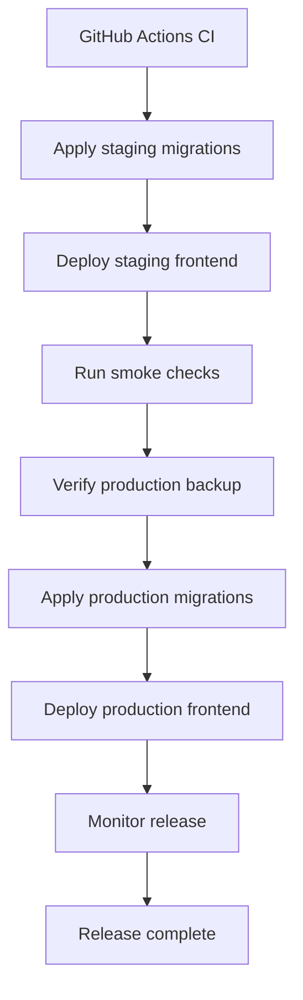

# Deployment Overview

This directory contains OCHP deployment guides and checklists for frontend hosting, Supabase database deployment, upgrades, and rollback.

## Deployment Flow

## Guides

- `VERCEL_DEPLOYMENT.md`: frontend hosting and static artifact verification.
- `SUPABASE_DEPLOYMENT.md`: database migration and Supabase release handling.
- `INITIAL_DEPLOYMENT_CHECKLIST.md`: first production deployment readiness checklist.
- `UPGRADE_DEPLOYMENT_CHECKLIST.md`: repeatable upgrade checklist.
- `ROLLBACK_CHECKLIST.md`: rollback and forward-fix checklist.

## Release Gate

A production deployment must have green CI, reviewed migrations, verified backup, staging smoke evidence, release notes, and a named rollback owner.
