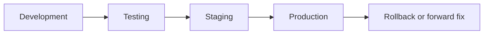

# Environment Strategy

OCHP uses four controlled environments: development, testing, staging, and production. Each environment must use a separate Supabase project or an isolated database instance, separate Vercel project or deployment target, and environment-specific browser configuration.

## Required Variables

| Variable | Required | Environments | Description |
| --- | --- | --- | --- |
| `OCHP_ENV` | Yes | All | One of `development`, `testing`, `staging`, `production`. |
| `OHGL_SUPABASE_URL` | Yes | All | Target Supabase project URL. |
| `OHGL_SUPABASE_ANON_KEY` | Yes | All | Browser anon key for the target project. Never use service-role keys in frontend config. |
| `OCHP_RELEASE_VERSION` | Recommended | Staging, production | Version shown in release notes and deployment records. |
| `OCHP_RELEASE_COMMIT` | Recommended | Staging, production | Git commit deployed to the environment. |
| `OCHP_LOCAL_PORT` | Optional | Development | Local static server port. |
| `SHA_API_BASE_URL` | Optional | Future integration only | Not required for current production deployment. |
| `DHIS2_API_BASE_URL` | Optional | Future integration only | Not required for current production deployment. |
| `FHIR_BASE_URL` | Optional | Future integration only | Not required for current production deployment. |
| `NOTIFICATION_PROVIDER` | Optional | Future integration only | Not required for current production deployment. |

## Development

Purpose: local implementation, code review support, and fast feedback.

Deployment process:

1. Configure `config.js` from `config.example.js` using a development Supabase project.
2. Serve the repository root with a local static server.
3. Run `npm run lint`, `npm run validate:migrations`, and focused tests before opening a pull request.

Rollback process: revert local code or switch to the previous branch. Do not reuse production data.

## Testing

Purpose: automated validation of branches and pull requests.

Deployment process:

1. GitHub Actions installs dependencies with `npm ci`.
2. CI runs lint/static checks, documentation validation, migration validation, build verification, and tests.
3. Test deployments may use synthetic Supabase data only.

Promotion process: a pull request may move toward staging only after CI is green and review is complete.

Rollback process: close or revert the pull request. No production rollback is involved.

## Staging

Purpose: production-like release validation.

Deployment process:

1. Deploy the release candidate commit to the staging Vercel project.
2. Apply migrations to the staging Supabase project in order.
3. Run smoke tests for auth, IAM approval, referral creation, workflow metadata loading, reports, and audit visibility.
4. Record staging evidence in the release checklist.

Promotion process: promote only an approved release candidate tag after staging smoke tests pass.

Rollback process: redeploy the previous staging tag and restore staging database from backup if a migration must be reversed for rehearsal.

## Production

Purpose: live operational use.

Deployment process:

1. Confirm backup and rollback owner.
2. Freeze release scope.
3. Apply database migrations during the approved release window.
4. Deploy the tagged frontend artifact.
5. Run post-deployment verification and monitor logs.

Promotion process: staging to production requires approved release notes, green CI, backup verification, and named incident lead.

Rollback process: redeploy the last known-good frontend tag. Database recovery should prefer forward-fix migrations; restore only under incident command when data integrity requires it.
