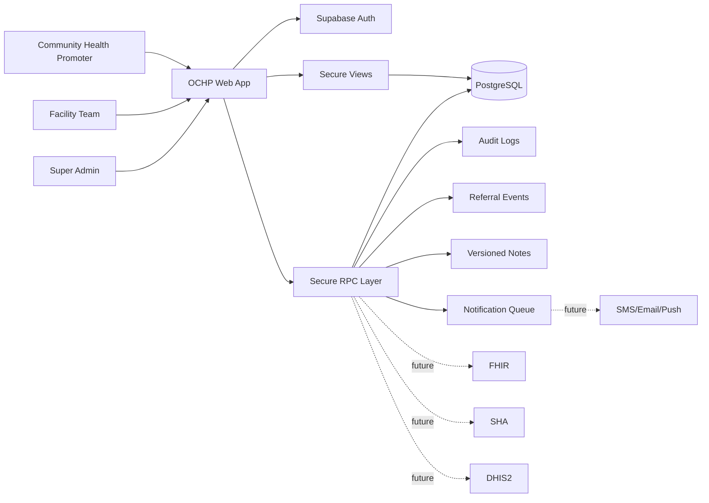
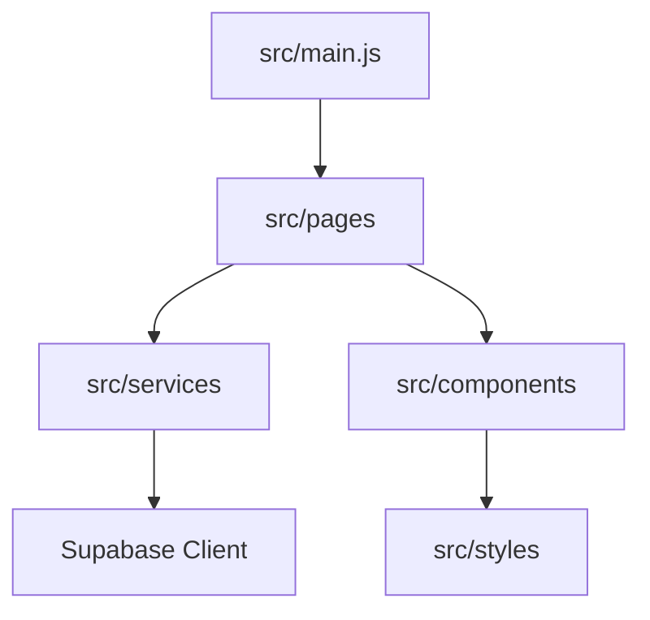
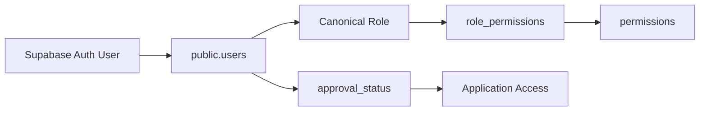
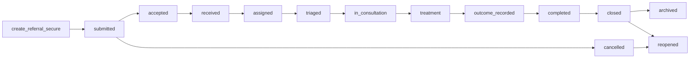

# System Architecture

OCHP is a browser-based healthcare operations platform for Community Health Promoter referral creation, facility receiving workflows, clinical progression, auditability, and future health-system integrations.

## System Overview

## Frontend Architecture

The frontend is a static JavaScript application served over HTTPS. It is a presentation layer and should not encode business-critical workflow rules.

Primary modules:

- `src/main.js`: application bootstrap, session restoration, page routing, shared data refresh.
- `src/pages/`: role-aware application pages.
- `src/services/`: Supabase access, auth, RBAC, notifications, workflow action orchestration.
- `src/components/`: reusable UI components.
- `src/styles/`: base, layout, component, and print styles.

## Backend Architecture

The backend is Supabase PostgreSQL with Auth, RLS, secure views, and secure RPCs. Browser clients read through security-invoker views and mutate protected data through RPCs.

Key layers:

- Identity and Access Management: users, roles, permissions, approval status, access audit.
- Referral Domain: patients, referrals, departments, ownership, assignment history, clinical notes, events, SLA timers.
- Workflow Command Engine: command RPCs that validate permission, ownership, transition, and payload before mutating referral state.
- Workflow Metadata Engine: metadata RPCs that describe actions, form fields, confirmation copy, icons, colors, and reference data.

## IAM Architecture

Canonical roles are `super_admin`, `facility_manager`, `facility_officer`, and `chp`. Legacy labels are normalized before permission checks.

## Referral Engine

The referral engine owns referral lifecycle state. The frontend displays current state and executes backend-returned actions.

## Database Architecture

Core storage is relational PostgreSQL. PHI is protected through encrypted columns and secure views where implemented. Append-only workflow artifacts preserve accountability.

Major groups:

- Identity: `users`, `permissions`, `role_permissions`, `user_access_audit`.
- Facilities: `facilities`, `departments`, `chp_directory`.
- Referral care: `patients`, `referrals`, `referral_events`, `referral_assignment_history`, `referral_clinical_notes`, `referral_sla_timers`.
- Operations: `notifications`, `audit_logs`.

## Supabase Responsibilities

Supabase provides:

- Authentication and session issuance.
- PostgreSQL storage.
- Row Level Security.
- Secure RPC execution.
- Static client access using the public anon key with RLS/RPC enforcement.

## Future Integrations

OCHP is prepared for controlled integration boundaries:

- FHIR: patient, encounter, observation, service request, and care plan interoperability.
- SHA: insurance/benefit eligibility and claim-related verification.
- DHIS2: aggregate reporting exports.
- Laboratory: orders, specimens, results, and result acknowledgement.
- Radiology: imaging requests, scheduling, reports, and attachments.
- Pharmacy: medication orders, dispensing, stock checks.
- Notification services: SMS, email, WhatsApp, and push notifications.

Future integrations should be implemented through backend services or secure RPC-mediated queues, not direct ungoverned browser calls.
