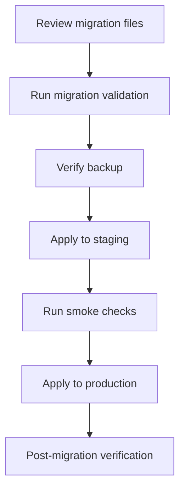

# Database Operations

## Scope

This runbook covers Supabase backup, restore, migration execution, rollback guidance, production migration checks, and disaster recovery for OCHP.

## Recovery Objectives

| Environment | RTO Target | RPO Target | Notes |
| --- | --- | --- | --- |
| Development | 1 business day | Best effort | Synthetic data only. |
| Testing | 4 hours | Best effort | Recreate from migrations and fixtures. |
| Staging | 4 hours | 24 hours | Restore from latest staging backup or rebuild. |
| Production | 4 hours initial target | 24 hours or better based on Supabase plan | Tighten after first recovery rehearsal. |

## Backup Frequency

- Production: automated daily backups at minimum, plus manual backup verification before production migrations.
- Staging: daily or before release candidate validation.
- Development/testing: optional; data must be disposable.

## Backup Runbook

1. Confirm target Supabase project.
2. Verify automated backup is enabled.
3. Before production migration, capture latest backup timestamp.
4. Record backup ID/timestamp, operator, environment, and release version.
5. Confirm backup visibility in the Supabase dashboard or CLI.
6. Do not proceed with production migration if backup status is unknown.

## Restore Runbook

1. Declare incident lead and database operator.
2. Freeze deployments and preserve logs.
3. Restore the selected backup into staging or a temporary project first.
4. Verify schema, RLS, secure RPCs, auth profile linkage, referrals, workflow events, and audit logs.
5. Compare restore point against expected data loss window.
6. Communicate RTO/RPO impact before production restore.
7. Restore production only after incident lead approval.
8. Run post-restore smoke tests.

## Migration Execution

## Pre-Migration Verification

- [ ] CI green on release commit.
- [ ] `npm run validate:migrations` passed.
- [ ] Migrations reviewed in filename order.
- [ ] No unapproved IAM, RLS, secure RPC, or referral workflow changes.
- [ ] Production backup verified.
- [ ] Maintenance window and rollback owner confirmed.

## Post-Migration Verification

- [ ] Super Admin login works.
- [ ] Pending approval queue loads.
- [ ] Approved CHP can create a referral.
- [ ] Secure workflow metadata loads.
- [ ] Reports/dashboard load for authorized roles.
- [ ] Audit logs are written.
- [ ] RLS remains enabled on sensitive tables.

## Failure Handling

- Stop at first migration failure.
- Capture SQL output and migration filename.
- Do not apply later migrations until the failed state is understood.
- Prefer a forward-fix migration for non-destructive corrections.
- Use rollback scripts only when reviewed, rehearsed, and approved.
- Restore from backup only when forward fix cannot preserve integrity.

## Migration Rollback Guidance

OCHP migrations should be forward-only by default. Rollback files are emergency references, not routine deployment tools. Never destructively remove clinical, referral, IAM, or audit records without incident lead and data owner approval.

## Recovery Testing

- Rehearse restore to staging at least quarterly.
- Rehearse migration failure handling before major releases.
- Record actual restore time and compare against RTO target.
- Record restored backup age and compare against RPO target.
