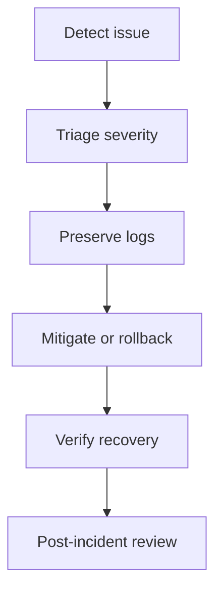

# Incident Response

## Incident Roles

| Role | Responsibility |
| --- | --- |
| Incident Lead | Owns decisions, timeline, and communications. |
| Technical Lead | Diagnoses application/database issue and recommends fix. |
| Database Operator | Handles backup, restore, migration, and SQL evidence. |
| Communications Owner | Sends stakeholder updates. |

## Severity Levels

| Severity | Definition | Initial Response Target |
| --- | --- | --- |
| SEV1 | Production unavailable, auth unavailable, or data integrity risk | 15 minutes |
| SEV2 | Core workflow impaired for multiple users | 30 minutes |
| SEV3 | Limited user/role issue with workaround | 1 business day |
| SEV4 | Documentation, non-production, or minor operational issue | Planned |

## Response Flow

## First 15 Minutes

- Confirm user impact.
- Assign incident lead.
- Freeze unrelated deployments.
- Capture current release version and commit.
- Preserve Vercel, Supabase, browser, and CI logs.
- Decide whether to rollback frontend immediately.

## Communications

- Provide status, impact, workaround, and next update time.
- Avoid sharing PHI in incident channels.
- Record decisions and timestamps.

## Closeout

- Document root cause.
- Document data impact.
- Document corrective actions.
- Add regression checks or runbook updates.
