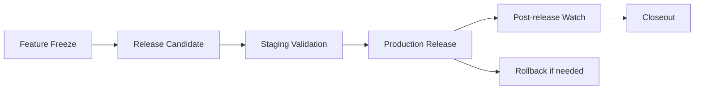

# Release Process

## Purpose

Define the controlled OCHP release path from feature freeze through production release, hotfix, rollback, version tagging, and release notes.

## Release Stages

## Feature Freeze

Feature freeze starts when sprint scope is complete and release stabilization begins.

Requirements:

- No new healthcare features.
- No unapproved IAM/RLS/referral workflow changes.
- Documentation updated for operational changes.
- CI green on the release branch.
- Known issues triaged.

## Release Candidate

A release candidate is a reviewed commit or tag deployed to staging.

Requirements:

- `npm run ci` or equivalent GitHub Actions checks pass.
- Migration order reviewed.
- Staging backup confirmed if staging data must be preserved.
- Staging smoke tests completed.
- Release notes drafted.

## Production Release

Production release requires explicit approval and a release window.

Steps:

1. Confirm production backup timestamp.
2. Confirm rollback owner and incident lead.
3. Apply production migrations.
4. Deploy frontend artifact from the approved tag or commit.
5. Run post-deployment smoke checks.
6. Monitor logs and user reports.
7. Publish release notes.

## Hotfix Release

Hotfixes are for production-impacting defects only.

Requirements:

- Document incident or defect.
- Keep code changes minimal and scoped.
- Run focused tests plus CI.
- Deploy to staging when time allows.
- Tag with a hotfix version.
- Publish hotfix notes and follow-up actions.

## Rollback

Rollback is approved by the incident lead when production impact is worse than rollback risk.

Frontend rollback: redeploy the last known-good Vercel deployment or release tag.

Database rollback: prefer forward-fix migration. Restore only when data integrity or service recovery requires it and after staging validation.

## Version Tagging

Recommended tag format:

- `ochp-<major>.<minor>.<patch>` for planned releases.
- `ochp-<major>.<minor>.<patch>-rc.<n>` for release candidates.
- `ochp-<major>.<minor>.<patch>-hotfix.<n>` for hotfixes.

Tag records must include commit, release notes, migration range, deployment timestamp, and operator.

## Release Notes

Release notes must include:

- Summary.
- Operational changes.
- Migration list.
- Deployment instructions.
- Rollback notes.
- Known risks.
- Verification checklist results.

## Closeout

- Confirm monitoring watch period completed.
- Confirm incidents or anomalies documented.
- Confirm release notes published.
- Confirm runbooks updated if the release changed operations.
