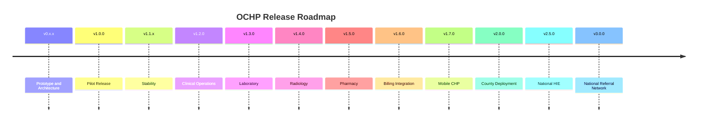

# Release Roadmap

This roadmap maps product milestones to expected SemVer releases. Dates should be assigned during release planning.

## v0.x.x Prototype and Architecture

Objectives:

- Validate CHP referral workflows.
- Establish Identity and Access.
- Build referral foundation.
- Implement workflow command and metadata architecture.
- Establish engineering governance.

## v1.0.0 Pilot Release

Objectives:

- Production-ready pilot release.
- Approved core referral lifecycle.
- Secure IAM and facility scoping.
- Workflow metadata-driven UI.
- Release management, CI, documentation, and test foundations.

## v1.1.x Stability

Objectives:

- Bug fixes.
- Security fixes.
- Performance baseline improvements.
- Workflow usability improvements that do not change lifecycle rules.
- Expanded automated test coverage.

## v1.2.0 Clinical Operations

Objectives:

- Clinical worklists.
- Consultation operations.
- Care team task handling.
- Operational clinical views.

## v1.3.0 Laboratory Module

Objectives:

- Lab orders.
- Specimen tracking.
- Results and acknowledgement.
- Lab workflow reporting.

## v1.4.0 Radiology Module

Objectives:

- Imaging requests.
- Scheduling.
- Radiology reports.
- Attachments and result review.

## v1.5.0 Pharmacy Module

Objectives:

- Medication orders.
- Dispensing workflow.
- Stock checks.
- Pharmacy reporting.

## v1.6.0 Billing Integration

Objectives:

- Billing workflow integration.
- Claim or invoice handoff points.
- SHA-aligned billing preparation where applicable.

## v1.7.0 Mobile CHP Application

Objectives:

- Mobile-first CHP workflows.
- Offline-capable referral drafting.
- Sync and conflict handling strategy.

## v2.0.0 Multi-Facility and County Deployment

Objectives:

- Multi-facility/county tenancy.
- County-level administration.
- Cross-facility analytics.
- Deployment automation for larger programs.

## v2.5.0 National Health Information Exchange

Objectives:

- FHIR interoperability.
- National system integration pathways.
- Standardized exchange contracts.

## v3.0.0 National Referral Network

Objectives:

- National-scale referral network capabilities.
- Cross-county referral coordination.
- Advanced analytics and governance.

