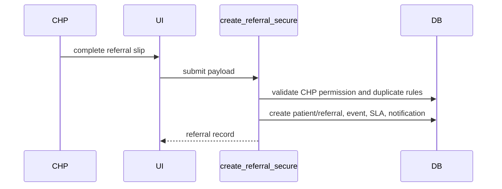
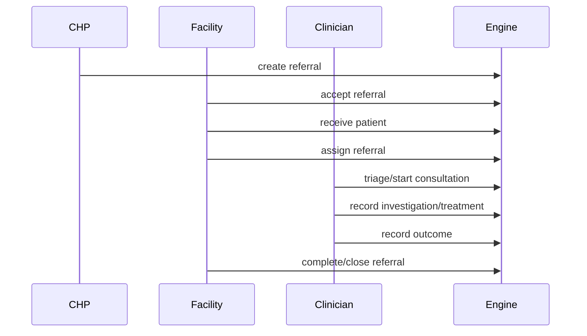

# Healthcare Workflows

This document describes the operational healthcare workflows supported by OCHP.

## Referral Creation

Outcome: referral starts as draft or submitted, with facility ownership and a timeline event.

## Approval and Receiving

Facility users review submitted referrals, accept them, and receive the patient when they arrive. Receiving can capture receiving notes and receiving staff/desk metadata when defined by the metadata engine.

## Assignment

Accepted or received referrals may be assigned to a department or clinician. Assignment requires backend validation and writes assignment history.

## Consultation

Triaged or assigned referrals can enter consultation. Consultation notes are versioned and linked to the referral.

## Investigation and Treatment

During consultation, clinicians may record investigations or treatments. These actions preserve clinical notes and keep the referral in the authoritative lifecycle.

## Outcome

Outcomes are recorded through command metadata-defined inputs. Valid outcome types come from backend reference data.

## Follow-up

Follow-up requests and schedules keep the referral active while documenting expected patient return or additional care.

## Closure

Completed referrals may be closed. Closed and cancelled referrals can only be reopened by authorized users. Archived referrals are final and should not be modified.

## Archive

Archiving is for terminal records that should remain available for audit/history while no longer participating in active workflows.

## End-to-End Sequence

