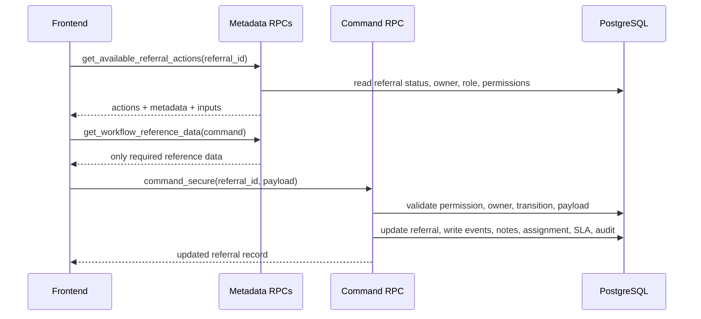
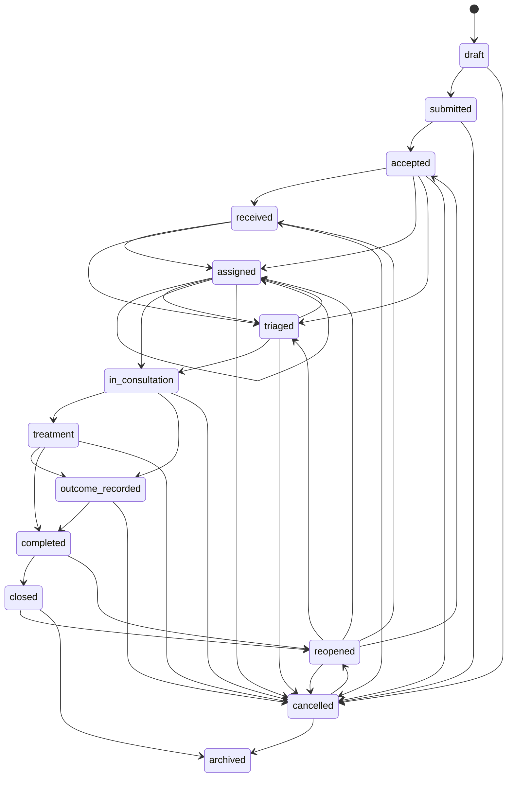
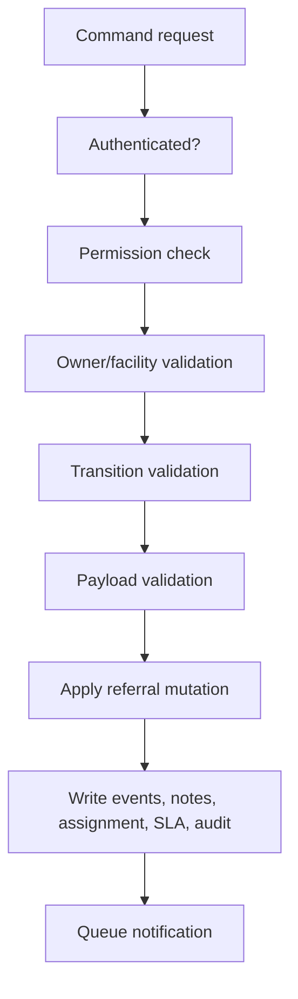

# Workflow Engine

The OCHP workflow engine is the authoritative backend layer for referral lifecycle progression. The frontend requests available actions, renders backend-provided metadata, and executes secure command RPCs.

## Architecture

## Command Families

Registration: `save_referral_draft_secure`, `submit_referral_secure`, `create_referral_secure`.

Receiving: `accept_referral_secure`, `receive_patient_secure`.

Assignment: `assign_referral_secure`, `transfer_department_secure`, `transfer_facility_secure`.

Clinical: `triage_referral_secure`, `start_consultation_secure`, `record_investigation_secure`, `record_treatment_secure`.

Outcome and follow-up: `record_outcome_secure`, `request_followup_secure`, `schedule_followup_secure`.

Closure: `complete_referral_secure`, `close_referral_secure`, `cancel_referral_secure`, `reopen_referral_secure`, `archive_referral_secure`.

## Transition Rules

Transitions are enforced by `validate_referral_transition`. Invalid transitions are rejected even if a frontend attempts to call a command directly.

## Ownership Model

Current owner is represented by owner type, owner user, owner facility, and owner department. The valid owner types are CHP, facility, department, and assigned user. Owner validation prevents unrelated facilities or unauthorized users from acting on referrals.

## Workflow Metadata

The metadata engine supplies:

- Action label and description.
- Group/category.
- Confirmation message.
- Icon and color tokens.
- Dynamic input schema.
- Validation messages.
- Required reference data sources.
- Secure RPC name for execution.

The frontend must not hardcode command forms or workflow presentation rules.

## Validation Flow

## Audit, Timeline, and SLA

Workflow commands write referral events for timeline rendering, audit logs for accountability, assignment history when owner fields change, clinical notes when note-bearing commands execute, and SLA updates for transition tracking.

## Notification Queue

Workflow actions enqueue notification events as referral events or notification records. Delivery channels should be implemented as consumers of the queue rather than command-side direct network calls.
