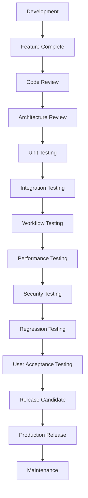

# Release Process

This document defines the OCHP release lifecycle from development through maintenance.

## Lifecycle Overview

## Development

Development happens on feature branches. Work must remain scoped to the approved sprint or release objective.

Entry criteria:

- Approved issue, sprint item, or release objective.
- Architecture impact understood.
- Test expectations identified.

Exit criteria:

- Implementation complete.
- Local checks pass.
- Documentation updated where needed.

## Feature Complete

A release becomes feature complete when no new scope is accepted except defect fixes, documentation corrections, test additions, or release blockers.

## Code Review

Reviewers assess maintainability, security, compatibility, tests, and consistency with architecture decisions.

## Architecture Review

Required for:

- New modules.
- Database migrations.
- Secure RPC changes.
- Workflow lifecycle changes.
- Integration boundaries.
- Breaking changes.

## Test Gates

Each release should pass:

- JavaScript syntax validation.
- Existing validation scripts.
- Unit tests.
- Integration tests where environment is available.
- Workflow tests for referral lifecycle.
- Regression tests for dashboards, reports, exports, auth, IAM, and tracker.
- Security tests for role, facility, RLS, and lifecycle restrictions.

## Release Candidate Policy

### RC1

First complete candidate after all planned scope is merged and release notes are drafted.

Promotion to RC1 requires:

- Feature complete.
- CI passing.
- Required documentation updated.
- No known critical defects.

### RC2

Created when RC1 has release-blocking fixes or required validation corrections.

### RC3

Created only when RC2 still has blockers. RC3 should trigger a release manager review of whether the release should be delayed.

## Promotion Rules

A release candidate can become production when:

- No critical or high severity open defects remain.
- UAT is signed off.
- Security review passes.
- Backup and rollback are verified.
- Release checklist is complete.
- Release owner, technical lead, and product owner approve.

## Rollback Rules

Rollback is required when production has:

- Patient safety risk.
- Data integrity risk.
- Security exposure.
- Severe availability incident.
- Critical workflow regression without immediate forward fix.

Frontend rollback should redeploy the previous tagged artifact. Database rollback should prefer forward-fix migrations unless an approved rollback plan has been rehearsed.

## Approval Process

Required approvers:

- Release owner.
- Technical/architecture lead.
- QA lead or tester representative.
- Product owner or healthcare operations representative.
- Security reviewer for security-impacting releases.

## Maintenance

After production release:

- Monitor support channels and logs.
- Triage defects.
- Patch urgent issues through hotfix branches.
- Update changelog with released changes.
- Record lessons learned.

## Change Management

### Feature Requests

Feature requests must describe the user, operational need, expected outcome, and release target. Product and architecture leads decide whether the request belongs in the current release, a future minor release, or the backlog.

### Bug Reports

Bug reports must include environment, role, facility scope, steps to reproduce, expected behavior, actual behavior, severity, and screenshots/logs where safe.

### Technical Debt

Technical debt should be tracked explicitly. Debt that affects security, patient safety, deployment reliability, or workflow correctness receives priority over cosmetic refactoring.

### Architecture Changes

Architecture changes require ADR updates and architecture review. Breaking changes require migration, compatibility, and rollback plans.

### Breaking Changes

Breaking changes are reserved for MAJOR releases unless a security emergency requires otherwise. Stakeholders must receive migration guidance before adoption.

### Deprecation Policy

Deprecated features remain available for at least one MINOR release where practical. Documentation must state replacement behavior, removal target, and migration steps.

### Migration Policy

Database migrations are forward-only by default. Production migrations require backup verification, staging rehearsal, and post-deployment checks.

## Phase 3 Exit Criteria

OCHP cannot begin Phase 4 Clinical Operations until all items below are complete:

- [ ] Engineering Foundation completed.
- [ ] Documentation completed.
- [ ] CI/CD operational.
- [ ] Database backup procedures verified.
- [ ] End-to-end workflow testing completed.
- [ ] Security review completed.
- [ ] Performance review completed.
- [ ] Regression testing passed.
- [ ] User Acceptance Testing completed.
- [ ] Critical issues resolved.
- [ ] Release Candidate tagged: `v1.0.0-rc1`.
